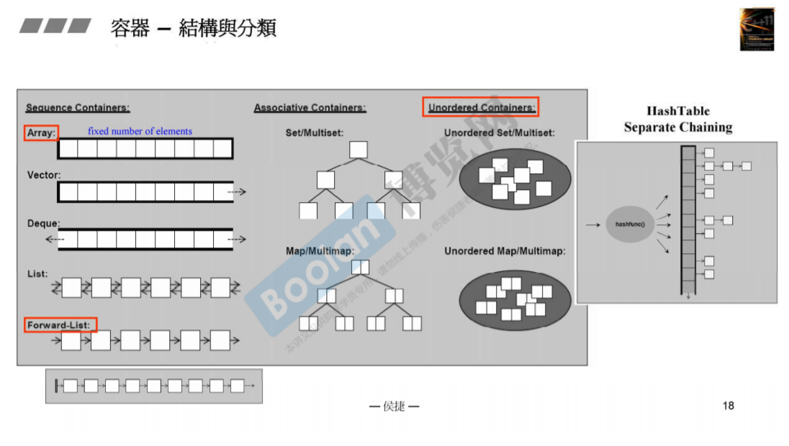
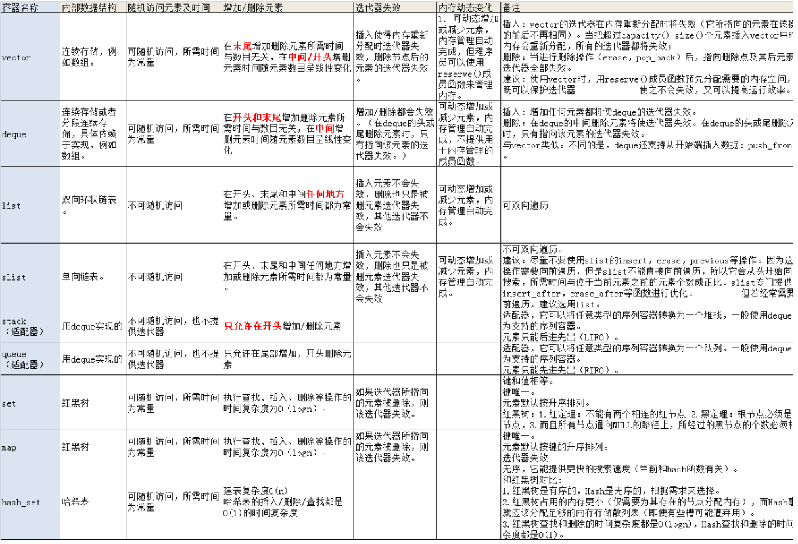

### 容器(containers)

本质就是封转带有快捷操作的内存？

容器底层构造：

### 容器一览无余  

| name | explain | note |
| :---: | :---: | :---: |
| Array | 数组 | 连续内存空间 |
| Vector | 向量 | 连续内存空间尾部操作,可增加 |
| Deque | 双端队列 | 连续内存空间首尾操作 |
| List | 双链表 | 双向环形链表 |
| Forward_List | 单链表 | 单链表 |
| Set/Multiset | 集合/可重复的集合 | 红黑树(平衡树) |
| Map/MultiMap | map | 红黑树(平衡树) |
| unordered_map | 每个元素都是唯一的map，不能有重复元素，内部元素没有顺序 | hash table |
| unordered_set | 每个元素都是唯一的set，不能有重复元素，内部元素没有顺序 | hash table |

相关链接[扩展](https://www.jianshu.com/p/9469031f7050)

