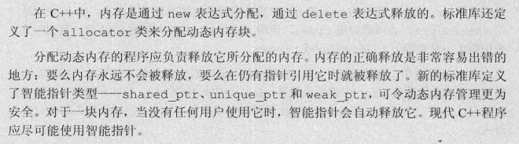

## 智能指针

| name | explain | note |
| :---: | :---: | :---: |
|auto_ptr| 只能指针，自动释放内存 | C++98(C++11以舍弃) |
|shared_ptr|允许多个指针指向同一对象| C++11 |
|unique_ptr|"独占"所指向的对象| |
|weak_ptr|一种弱引用,指向shared_ptr所管理的对象| |

### shared_ptr

是个模本类，创建一个智能指针时，必须提供额外的信息――指针可以指向的类型  
默认初始化的智能指针中保存着一个空指针  
使用方式和普通指针类似，解引用一个智能指针返回它指向的对象  
在条件判断中使用智能指针，效果就是检测它是否为空  
```c++
shared_prt<string> p1;  
if(p1 && p1->empty) {  
    *p1 = "hello";  
}
```

shared_ptr都有一个关联的计数器，通常称其为**引用计数(reference const)**
无论我们拷贝一个shared_ptr，计数器都会增加。当一个shared_ptr初始化另一个shared_ptr，
或将它作为一个参数传递给一个函数以及作为函数的返回值，它关联的计数器就会递增， 
当我们给shared_ptr赋予一个新值或是shared_ptr被销毁(例如一个局部的shared_ptr离开其作用域)，计数器会递减  

注意：**当shared_ptr的引用计数器为0,它就会自动释放自己所管理的对象，以及释放相关联的内存**


**shared_ptr 和 unique_ptr都支持的操作。只适用shared_ptr**  


shared_ptr智能指针和new的结合使用  
```c++
shared_ptr<int> p1 = new int(1);  //错误： 必须使用直接初始化形式
shared_ptr<int> p2(new int(1));   //正确 ： 使用了直接初始化

void process(shared_ptr<int> ptr) {    
    //使用ptr
} //离开作用域，被销毁

shared_ptr<int> p(new int(1)); //引用计数为1
process(p);  //拷贝p会递增它的引用计数；在process中引用计数值为2
int i = *p;  //正确 引用计数值为1

int *x(new int(1)); //普通指针，危险，不是智能指针
process(x);         //错误，不能将int* 转换为shared_ptr<int>
process(shared_ptr<int>(x));  //合法，内存会被释放
int j = *x;      //未定义 x为空悬指针
```

**定义和改变shared_ptr的其他方法**  
  


### unique_ptr

一个unique_ptr"拥有"它所指向的对象。与shared_ptr不同，某时刻只能有一个unique_ptr指向一个给定对象，同生共死  
注意：**不支持拷贝和赋值**  
虽然我们不能拷贝或赋值unique_ptr，但可以通过release或reset将指针的所有权从一个(非const)unique_ptr转移到另一个unique_ptr

```c++
//p1返回其所指的对象 p1转移p2
unique_ptr<string> p2(p1.release()); 
unique_ptr<string> p3(new string("Trex"));
p2.reset(p3.release()); //release会切断unique_ptr原来管理对象间的关系，release返回的指针通常用来初始化另一个智能指针或给；另一个智能指针赋值

p2.release; //没有错但我们会丢失指针
auto p = p2.release;

unique_ptr<int> clone(int p) return unique_ptr<int>(new int(p));

```
**unique_ptr相关的操作**  


### weak_ptr

weak_ptr是一种不控制所指对象生存期的智能指针，它指向由一个shared_ptr管理的对象。  
将一个weak_ptr绑定到一个shared_ptr不会改变shared_ptr的引用计数

```c++
auto p = make_shared<int>(42);
weak_ptr<int> wp(p);    wp弱引用， p的引用计数没有改变

if(shared_ptr<int> np = wp.lock()) {
    //true np对象是安全的
    //在if中， np和p共享对象
}
```
**weak_ptr相关操作**  


## 直接管理内存 new/delete

### new/delete

在自由空间中分配的内存是无名的，因此new无法围棋分配的对象命名，而是返回一个指向该对象的指针  
new和delete都是成双成对出现的  
忘记delete内存， 忘记释放动态内存就是"内存泄漏"  
delete后内存，应将指针置为nullptr  

### new[]/delete[]

```c++
//必须确定分配多少个int
int *pia = new int[get_size()]; 指向第一个int
delete[] pia;
```

**指向shared_ptr相关操作**  


## allocator类

标准库allocator定义在头文件memory中，它帮助我们将内存分配和对象构造分离开

```c++
allocator<string> alloc;            //可以分配string的allocator对象
auto const p = alloc.allocator(n);  //分配n个未初始化的string

//通过allocator分配的内存是未构造 需通过construct成员函数为其初始化构造对象
auto q = p;
alloc.construct(q++);               //*q 为空字符串
alloc.construct(q++, 10, 'c');      //*q 为cccccccccc
alloc.construct(q++, "hi");         //*q 为hi

cout << *p << endl;                 //正确
cout << *q << endl;                 //灾难 q指向未构造的对象

//我们用完所有的对象后，对每个构造的元素调用destroy来销毁它们
while(q != p) alloc.destroy(--q);   //释放我们构造的string

```

**标准库allocator类及其算法**  


**拷贝和填充未初始化内存allocator算法**  


## 小结

**智能指针和动态内存小结**  


## 术语表

**智能指针和动态内存小结**  
